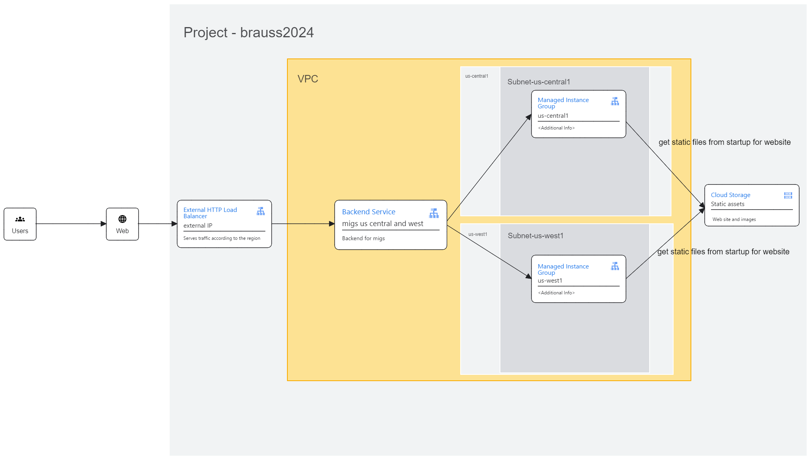

# tf
terraform exercises

Course
https://app.pluralsight.com/ilx/video-courses/fa1fd952-76e1-4807-a0e2-3499c9b5f11b/4e006d39-6d6f-4a37-8bb5-1e2ee555aa68/1c245362-dd94-4948-9ea6-4c1c06b77d94

MIG / LB Modules
https://github.com/terraform-google-modules/terraform-google-lb-http/blob/15c534c6b9c0e799aa964c89ba017ca834e93cb6/examples/multi-mig-http-lb/main.tf

Architecture (see architecture.json to make any changes and goto [Gooogle Cloud Developer Architecture](https://googlecloudcheatsheet.withgoogle.com/architecture) )
